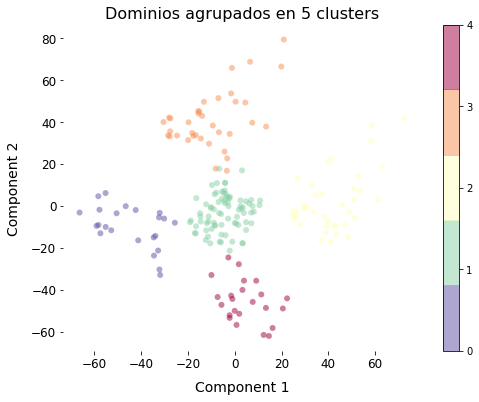

# ML_Cluster

You are the owner of a shop. It doesn't matter if you own an e-commerce or a supermarket. It doesn't matter if it is a small shop or a huge company such as Amazon or Netflix, it's better to know your customers. You were able to collect basic data about your customers holding a membership card such as Customer ID, age, gender, annual income, and spending score. This last one is a score based on customer behavior and purchasing data. There are some new products on the market that you are interested in selling. But you want to target a specific type of clients for each one of the products.

The most important features appear to be Annual Income and Spending score.  We have people whose income is low but spend in the same range - segment 0.

People whose earnings a high and spend a lot - segment 1.

Customers whose income is middle range but also spend at the same level - segment 2. 

Then we have customers whose income is very high but they have most spendings - segment 4.

And last, people whose earnings are little but they spend a lot- segment 5.

Imagine that tomorrow we have a new member. And we want to know which segment that person belongs. We can predict this.

